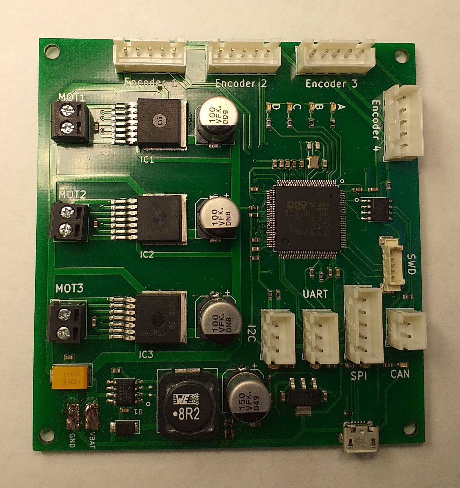

# Motor control board

STM32F767 based motor control board.

- control up to 3 DC motors
- 4 hardware encoder inputs.

**Holonomic drive:** Use the 3 motors, and the first 3 encoders.

**Differential drive:** Use the first 2 motors. Use the first 2 encodeurs for the motor encodeurs, and the last 2 for the odometry wheels (if applicable).

Fetch all submodules with:

`git submodule update --init --recursive`

